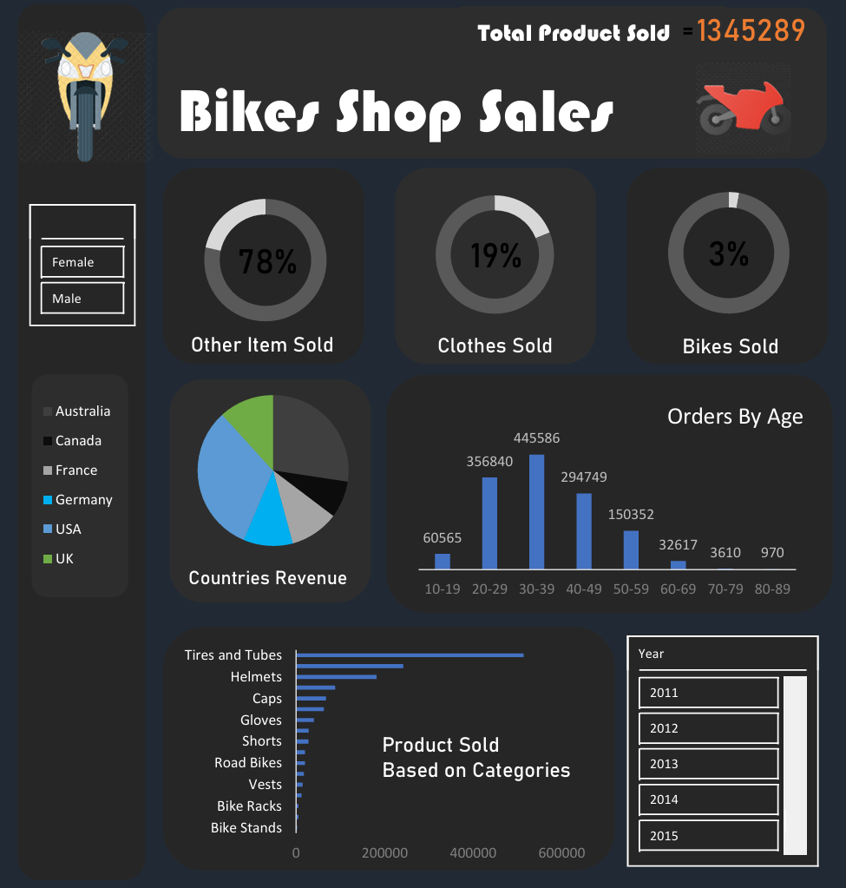
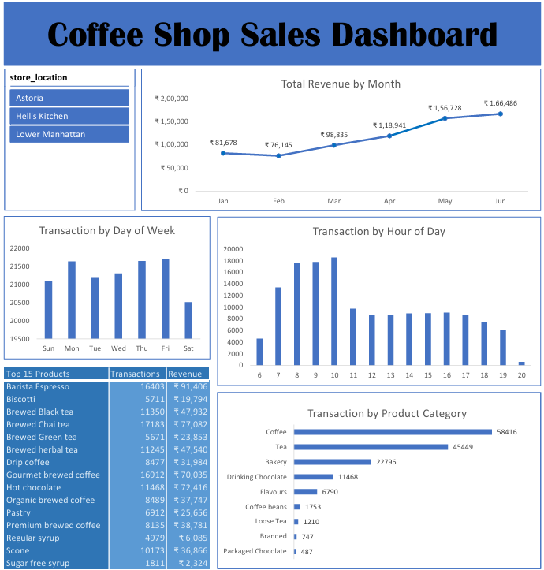

# Excel Projects — Dashboards & Analysis

A collection of complete data analysis projects and interactive dashboards built using Microsoft Excel.

## Overview

This folder contains end-to-end Excel projects focused on real-world analytical scenarios. Each workbook demonstrates data preparation, analysis, visualization, and dashboard design to support insights and decision-making.

Projects included:

* Bike Sales Dashboard
* Bike Shop Sales Dashboard
* Coffee Shop Sales Dashboard
* HR Employee Analysis Dashboard
* McDonald’s Sales Analysis Dashboard

## Tools & Techniques Used

* **Microsoft Excel**
* Pivot Tables and Pivot Charts
* Advanced formulas and functions
* Data cleaning and transformation
* Interactive filters and slicers
* Dashboard layout and design

## How to Use

1. Clone the main repository:

```bash
git clone https://github.com/UmerAzmi/<your-data-analytics-repo>.git
cd <your-data-analytics-repo>/projects/excel
```

2. Open any `.xlsx` file using Microsoft Excel.

Each workbook contains a complete analysis or dashboard and can be explored independently.

## Dashboard Previews

### Bike Sales Dashboard

<p align="center">
  
</p>

### McDonald’s Sales Dashboard

<p align="center">
  
</p>

### HR Employee Analysis Dashboard

<p align="center">
  
</p>

### Bike Shop Sales Dashboard

<p align="center">
  
</p>

### Coffee Shop Sales Dashboard

<p align="center">
  
</p>

## Notes

* Each project represents a complete analytical workflow from raw data to visualization.
* Dashboards are interactive and support filtering and drill-down analysis.
* Designed to demonstrate practical Excel-based business intelligence skills.
* This collection represents documented project work. Additional skills and experience exist beyond what is included here.

