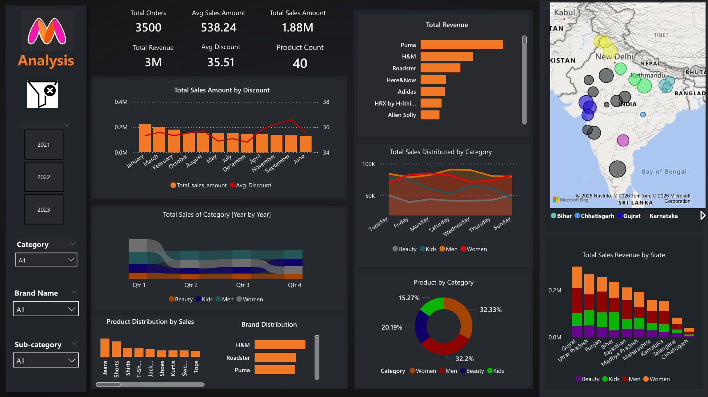
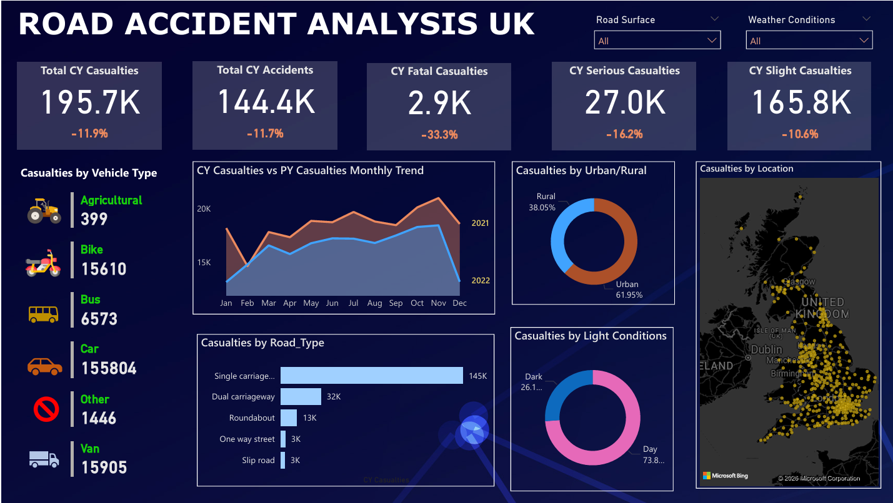
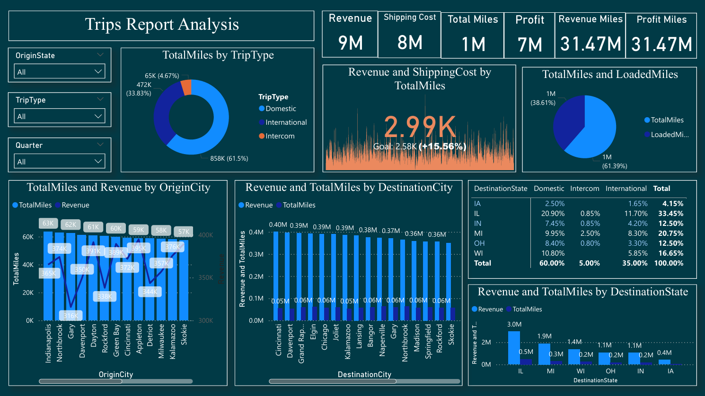

# Power BI Projects — Dashboards & Analysis

A collection of complete business intelligence projects and interactive dashboards built using Microsoft Power BI.

## Overview

This folder contains end-to-end Power BI projects developed for real-world analytical scenarios. Each report demonstrates data preparation, modeling, analysis, and visualization to deliver actionable insights.

Projects included:

* Myntra Dashboard
* Road Accidents Dashboard
* Trips Report Dashboard

## Tools & Techniques Used

* **Microsoft Power BI Desktop**
* DAX (Data Analysis Expressions)
* Power Query (M language)
* Data modeling and relationships
* Interactive visuals, filters, and slicers
* Dashboard design and layout

## Folder Structure

* **Datasets/** — Source data used in the reports
* **Images/** — Dashboard preview images for documentation
* `.pbix` files — Complete Power BI project files

## How to Use

1. Clone the main repository:

```bash
git clone https://github.com/UmerAzmi/<your-data-analytics-repo>.git
cd <your-data-analytics-repo>/projects/powerbi
```

2. Open any `.pbix` file using Microsoft Power BI Desktop.

Each file contains a complete report and can be explored independently.

---

## Dashboard Previews

### Myntra Dashboard

<p align="left">
  
</p>

### Road Accidents Dashboard

<p align="left">
  
</p>

### Trips Report Dashboard

<p align="left">
  
</p>

---

## Notes

* Each project represents a full analytics workflow from raw data to visualization.
* Dashboards are interactive and support filtering and drill-down analysis.
* Designed to demonstrate practical business intelligence skills using Power BI.
* This collection represents documented project work. Additional skills and experience exist beyond what is included here.
